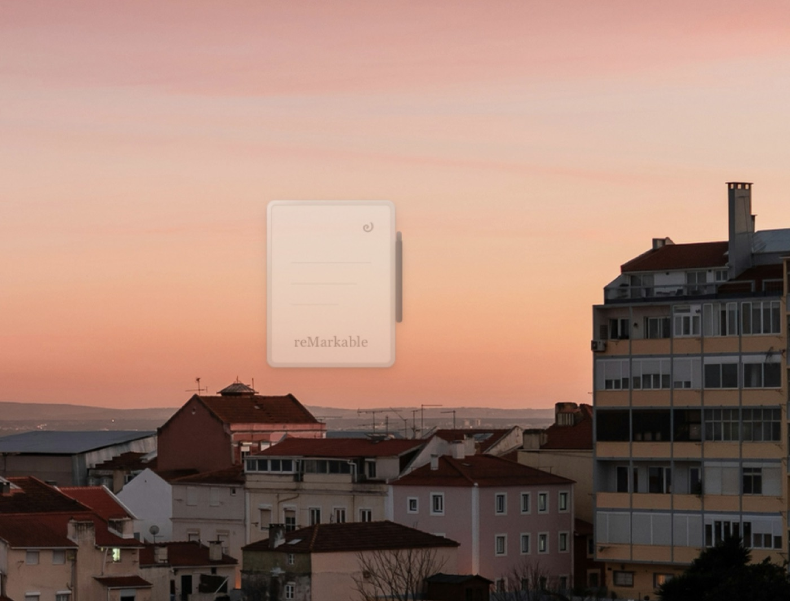
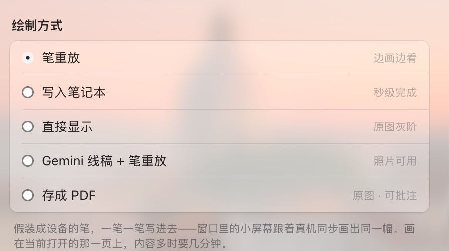
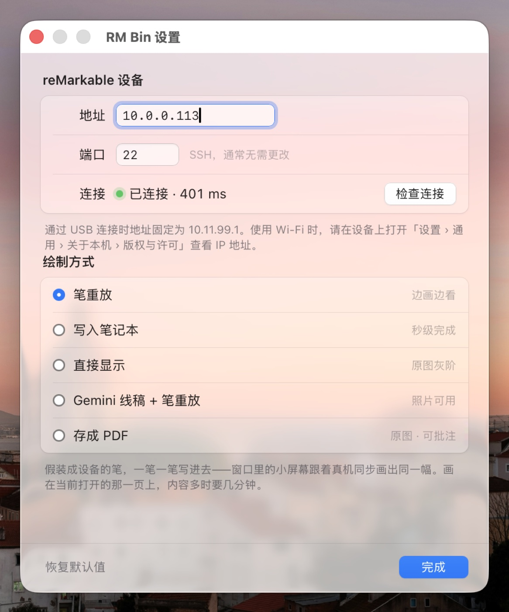

# RM Bin

**拖一张图进去，它出现在你的 reMarkable 上。**

一枚停在桌角的迷你 Paper Pro。松手的那一刻，窗口里的小屏幕和你手边的真机同时开始落墨——同一幅画，同一个节奏。



<sub>静止时它是半透明的，不打扰任何东西。有文件靠近才会亮起来、抬起来。</sub>

### [↓ 下载 for macOS](https://github.com/JIACHENG135/rm-bin/releases/latest)

已用 Developer ID 签名并通过 Apple 公证，首次打开不会被拦 · [网站](https://jiacheng135.github.io/rm-bin/)

---

## 它解决什么

把一张图弄到 reMarkable 上，官方的路子是：打开桌面端、导入、等同步、在设备上翻出来。RM Bin 把它压缩成一个动作——**拖过去，松手**。

但它真正有意思的地方不是快，是**你能看着它发生**。默认的「笔重放」假装成设备的笔，一笔一笔把画写进去；窗口里那块 e-ink 小屏幕跟着真机的实际进度推进扫描线。不是播动画——是同一个事件被看了两次。

## 怎么用

| | |
|---|---|
| **拖** | 图片拖到那台小设备上。纸面抬起来，跟着光标磁性倾斜。不是图片？它轻轻摇头。 |
| **描** | 图像转成笔画。你选的方式决定它是被一笔笔写下去，还是整页递过去。 |
| **落墨** | 扫描线自上而下推进，跟的是设备的真实进度，不是计时器。完成时 Marker 手写一个对勾。 |

失败也不骗你：设备连不上、图上描不出线条，就不写对勾，改成摇头。

## 五种落墨方式



| 方式 | 看到的是 | 能用笔写 | 会保存 | 耗时 |
|---|---|---|---|---|
| **笔重放**（默认） | 线稿 | ✓ | ✓ | 几分钟 |
| **写入笔记本** | 线稿 | ✓ | ✓ | 几秒 + 重启界面 |
| **直接显示** | 原图，完整灰阶 | ✗ | ✗ | 十几秒 |
| **Gemini 线稿 + 笔重放** | 重画的线稿 | ✓ | ✓ | 一分钟左右 |
| **存成 PDF** | 原图，完整灰阶 | ✓ | ✓ | 几秒 |

没有一个是全能的——每种的具体取舍写在下面，也写在设置面板里每一行的右边。

## 设置

`⌘,`，或者右键那台小设备——窗口上不放任何按钮，右键弹出的是真正的系统菜单。



- 改完失焦即生效，没有「保存 / 取消」
- 「检查连接」对设备 SSH 端口做一次真实握手，报往返延迟，或者到底哪一步不通（超时 / 拒绝 / 解析失败，分得清清楚楚）
- 背景是 macOS 26 的 Liquid Glass（`NSGlassEffectView`），旧系统自动退回经典材质，不会变成一块灰板
- 配置存在 `~/Library/Application Support/com.zoe.rmbin/settings.json`，先写临时文件再 rename

## 装它

下载 [最新版 `.dmg`](https://github.com/JIACHENG135/rm-bin/releases/latest)，拖进「应用程序」。

设备地址在 **设置 › 通用 › 关于本机 › 版权与许可** 里；USB 直连时固定是 `10.11.99.1`。笔重放和直接显示需要 Mac 能免密 ssh 到 `root@设备地址`（`ssh-copy-id` 一次即可，密码在同一个页面里）。

**需要**

- macOS 11+（Liquid Glass 效果需要 macOS 26）
- Apple Silicon
- reMarkable 2 / Paper Pro，与电脑同网络，或 USB 直连

## 做成什么样

- **窗口上没有任何控件。** 设置和退出都在右键菜单里，由系统绘制。悬停时唯一的反馈是 Marker 往外滑 1.5px——像拿起设备时笔会错位一点
- **静止时缓慢呼吸**，偶尔在屏角画一笔涂鸦，然后自己淡去
- **扫描线由后端的真实进度驱动。** 设备卡住，画面就停在那里

## 自己构建

```sh
npm install
npm run tauri dev     # 开发
npm run release       # 构建 + 签名 + 公证 + 校验（需要 Developer ID）
```

需要 Rust 和 Node。**不要用 `sudo`**——它会把构建产物写成 root 所有，还会让 codesign 去读 root 的钥匙串，报出一个和签名毫无关系的 `errSecInternalComponent`。

---

# 它怎么做到的

下面是实现细节：五种方式各自的代价、帧缓冲那条路怎么走通的，以及在真机上踩过的坑。

## 五种方式，各自的代价

设置里选，各有各的代价，没有一个是全能的：

| | 看到的是 | 能用笔写 | 会保存 | 耗时 |
|---|---|---|---|---|
| **笔重放**（默认） | 线稿 | ✓ | ✓ | 几分钟 |
| **写入笔记本** | 线稿 | ✓ | ✓ | 几秒 + 重启界面 |
| **直接显示** | 原图，完整灰阶 | ✗ | ✗ | 十几秒 |
| **Gemini 线稿 + 笔重放** | 重画的线稿 | ✓ | ✓ | 一分钟左右 |
| **存成 PDF** | 原图，完整灰阶 | ✓ | ✓ | 几秒 |

- **笔重放**假装成设备的笔，一笔一笔写进去。慢，而且画在当前打开的那一页上——但它是唯一**正在发生**的那个：窗口里的小屏幕和真机在同一时刻画同一笔。下面「绘制管线」讲的就是它。
- **写入笔记本**直接合成一个 v6 `.rm` 页面塞进 xochitl 的文档库（[`rm/rmfile.rs`](src-tauri/src/rm/rmfile.rs)、[`rm/upload.rs`](src-tauri/src/rm/upload.rs)）。格式无文档，是照着 Kaitai 规范和真机文件逐字节对出来的；页面的固定骨架干脆不合成，`page_template.bin` 就是一页真的空白页，抹掉作者 UUID 后往后追加线条块——要错的东西少，而且固件改动没碰到的部分自动跟着对。代价是文件一次性出现，窗口里的绘制退化成事后回放，且必须重启 xochitl 它才看得见。
- **存成 PDF**（[`rm/pdf.rs`](src-tauri/src/rm/pdf.rs)）把图片包成单页 PDF，POST 给设备自己的导入接口。表格里唯一三项全中的一行，而且对设备的要求最少：不用 SSH、不用密钥、不用停 xochitl、不用往设备上装任何东西——平板本来就有一个专门收文档的 HTTP 接口。PDF 是手写的（五个对象加一张交叉引用表，用不着为此引一个几千行的库），图片以 `/DCTDecode` 原样嵌入，不二次编码。前提是「设置 › 通用 › 存储 › USB 网页界面」打开且可达，默认情况下这意味着走 USB 线（10.11.99.1）。
- **直接显示**见下。
- **Gemini 线稿 + 笔重放**（[`rm/gemini.rs`](src-tauri/src/rm/gemini.rs)）先让模型把图重画成线稿，再走笔重放。描线器需要的是线，而照片里没有线——它只有调子，把调子二值化得到的是一团色块，骨架化之后是一团乱麻。所以先补上那一步。落到纸上的是一幅**照着画的画**，不是原图，这也是它单独成为一种模式、而不是悄悄加在别的模式前面的原因：本来就干净的线稿走这条只会更差。密钥读环境变量 `GEMINI_API_KEY`（从访达启动的 app 拿不到 shell 环境变量，得先 `launchctl setenv`）。HTTP 走 `curl` 子进程而不是 Rust 客户端——这个 app 本来就靠 spawn `ssh` 跟外界打交道，为了一分钟一次的请求引入一整套 TLS 依赖不划算；密钥不进 argv（`ps` 是所有人可读的），写在一个 0600 的 curl 配置文件里，用完即删。

## 直接显示：画在帧缓冲上

这条路放弃了「文档」去换「图片」。前两条产出的都是**墨**，因此只能是笔画得出来的东西——照片描出来是一团麻。这条直接把 1620×2160 的灰度像素画到面板上，照片就是照片。

面板不是能随便画的帧缓冲。`/dev/fb0` 不存在；`/dev/dri/card0` 是真的（imx-drm，LVDS，支持 dumb buffer），但它的模式是 **405×1084**，而面板是 1620×2160——405×4 正好是 1620，以 85Hz 扫出去的是**打包的波形相位数据**，不是灰阶。自己实现那套波形序列是几个月的逆向。

`libqsgepaper.so` 已经做完了。它闭源、无文档，导出一个 `EPFramebuffer`，`swapBuffers` 会把它内部那块 QImage 推上面板——问题只剩怎么拿到那块 QImage 的指针，而它没有访问器。

办法（[asivery 的 epfb-re](https://github.com/asivery/epfb-re)）是**让厂商代码自己交出来**：插桩 `QImage` 的构造函数，打开记录开关再调 `EPFramebuffer::instance()`，它构造的每一块 QImage 都被记下，其中两块就是帧缓冲。设备上这两块尺寸完全一样（都是 1620×2160），靠**格式**区分：RGB32 那块是能写的，Grayscale8 那块是厂商自己渲染用的。

```
Mac（Rust）                                    设备（C，~200 行）
图片 → 灰度 → 等比缩放 → 分 18 条带 ──ssh──→ rmfb-agent → 贴进 buffer → swapBuffers
                              ↑                              │
                              └──────── ack（刷完才回）───────┘
```

设备端刻意做得很笨：读一个矩形和一片 8 位灰度，贴上去，刷新，回一个字节。它什么都不决定。缩放、色调、出现的顺序和快慢全在 Mac 上的 Rust 里——那唯一必须留在设备上的东西（C++ ABI 边界）依赖一个闭源库、一个特定 Qt 版本和一台只能 ssh 过去的机器，所以要小到能写完就不再动。

ack 不只是握手：它在**刷新完成之后**才发，所以「已确认的条带」约等于「已经在玻璃上的东西」，进度是真的。

编译要在 aarch64 Linux 上，并且需要设备自己的三个库（专有，不入仓库）：

```sh
cd rmfb
./build.sh --pull root@10.11.99.1   # 从你自己的设备上取
./build.sh
```

产物 `rmfb-agent` 和 `librmfb.so` 一共 160KB，用 `include_bytes!` 编进 app，第一次用时自动 scp 到设备——不需要 xovi、AppLoad 或开发者模式以外的任何东西。

### 这条路上踩到的三件事

- **厂商库把日志打在 stdout 上**，而那正是协议管道。第一版握手读到的是 `...panel tft: C0F` 而不是 `RMFB 1620 2160 4`，于是在屏幕已经被接管之后放弃了。现在 agent 开机第一件事是把真 stdout 复制一份私藏，把 fd 1 指向 stderr。
- **`child.kill()` 杀不到设备上的进程**，它只杀本地 ssh。上面那次失败因此在设备上留下一个孤儿 agent，抱着面板不放、xochitl 也没起来，屏幕全白。现在是关 stdin 让远端自己读到 EOF 退出，然后立刻恢复 xochitl。
- **部署戳用文件大小是不够的。** 注释里原话是「两次构建同时撞上相同大小不是实际会发生的事」——下一次构建的 agent 就是同样的 13592 字节，于是设备继续跑旧版，看起来像"修了没用"。改成内容哈希，并补了一个专门盯这个场景的测试。

安全网：agent 启动前会在设备上挂一个 `sleep 600; systemctl start xochitl`，脱离终端运行。Mac 崩了、Wi-Fi 断了、人走了，平板都会自己回来。想立刻回来就右键小窗 →「恢复设备界面」。

## 绘制管线

设备没有能用的导入接口，但笔的数字化仪 `/dev/input/eventN` 会照单全收任何人写进去的事件——所以就假装成那支笔。这是 [rm-agent](../rm-agent) 的老办法，区别在于 rm-agent 跑在设备上写本地文件，rm-bin 跑在 Mac 上写进一条 ssh 管道：

```
图片 → 匀光 → 二值化 → 骨架化 → 剪毛刺 → 描成折线 → 简化 → 按横带排序 → input_event 字节 → ssh → dd > /dev/input/eventN
                                                    │                                             │
                                            draw-plan（同一批折线）                     draw-progress（已落笔数）
                                                    └──────────────────┬──────────────────────────┘
                                                                       ▼
                                                            窗口里逐笔画出同一幅画
```

- **描线**（[`src-tauri/src/rm/imageproc.rs`](src-tauri/src/rm/imageproc.rs)）的骨干是 Zhang-Suen 细化 + 骨架追踪，从 rm-agent 原样搬过来的，改动可以直接互相 diff。两端各加了一层，都是为了字：
  - **匀光**。全局一个 Otsu 阈值只在整张图光照一致时才成立。拍下来的纸不是——亮处分开墨与纸的那条线，在暗处压在**纸**下面，于是一整个角落变成实心黑，追踪器交回来的是沿着阴影边缘的一条长线，字一个都没有。所以先按分块估计「纸有多白」，插值成一张光照曲面除掉，再取一次全局 Otsu。光照均匀时曲面是平的，这一步等价于它替换掉的那个全局阈值
  - **剪毛刺**。细化会在每个笔画交叉处留下两三像素的倒刺，一页字于是长满绒毛，笔照画不误，看上去就是每个字周围一圈脏。只剪「从自由端走进交叉点」的短枝——不碰交叉点的短笔画是标点、是 i 上的点、是「点」这一笔，原样留着
  - **简化**（Ramer-Douglas-Peucker，0.9px）看着像优化，其实是前提。骨架是逐像素的阶梯，而发事件时会按数字化仪的步长（约 5 个屏幕像素）重新取样，所以一条直线原本要花五六倍的事件去画。简化之后，画一幅图要多久就和描它用了多高的分辨率脱钩了——这才使得「按页面真实尺寸描线」付得起
- **设备差异**（[`src-tauri/src/rm/device.rs`](src-tauri/src/rm/device.rs)）在 rm-agent 里是 `#[cfg(target_pointer_width)]`，因为它只为一台设备编译；rm-bin 面对的是「插上来的那台」，所以同样的事实得变成运行时的值——`struct input_event` 在 rM2 的 32 位内核上是 16 字节、Paper Pro 上是 24 字节，笔的设备节点和量程也不同。落笔前 `uname -m` 问一句就都定了
- **同步**（[`src-tauri/src/rm/draw.rs`](src-tauri/src/rm/draw.rs)）是这次真正新写的部分。第一版是**让画去迁就窗口**：为了让那道自上而下的扫描线诚实，把折线按横带切开——真机上切口看得见（见下），而且只换来一个近似。现在反过来，**让窗口去迁就画**：折线整条发出，同时把同一批折线（图像坐标、抽稀量化过）通过 `draw-plan` 给前端，`draw-progress` 再报「已落笔数」（带小数，所以笔尖正在走的那一笔是半画出来的）。前端就按同样的顺序、同样的时刻把同样的线画在小屏上。什么都不用切，对应关系也不再是近似
- **横带**只剩排序作用：大致自上而下画比按追踪器发现的顺序画看起来更像有意为之，仅此而已
- **节流即时钟**（`device::push`）：一次性灌进去会让 xochitl 打出 "Dropped pen event!" 并把笔的状态搞乱，所以按 20 个事件 / 4ms 发。副作用是「已写出的字节」很接近「已落在纸上的墨」，进度才有得可报——也意味着一次绘制要几秒到十几秒，窗口里就诚实地画那么久

需要 Mac 能免密 ssh 到 `root@设备地址`（`ssh-copy-id` 一次即可；密码在设备的「设置 › 通用 › 关于本机 › 版权与许可」里）。

### 真机上踩到的三件事

都在 Paper Pro（`reMarkable Ferrari`，固件 3.2x）上验过，也都写进了代码注释：

- **`cat > /dev/input/eventN` 在 Paper Pro 上根本不能用。** 内核只接受整数个 `struct input_event` 的写入，而写多少是由远端那个程序的缓冲区决定的：busybox `cat` 一次写 4096 字节，能被 rM2 的 16 整除，却除不尽 Paper Pro 的 24——于是第一块之后就 EINVAL。Python 老原型只跑 rM2，所以从没撞上。现在远端用 `dd bs=… iflag=fullblock`，`iflag` 是关键的那一半：没有它 dd 会把管道给多少就写多少，照样错位
- **穿过工具栏的笔画不是线，是按钮。** 第一次满版测试图确实画出来了，同时还把页面转成横向、打开了溢出菜单、加了一页。所以留了 10% 的页边距（工具栏停在任意一边都躲得开），并且在落笔前先悬停 400ms 等 xochitl 把工具栏收起来
- **切笔画会看出来。** xochitl 给每笔两端做收尾渐细，一条竖线被切成多段之后边缘是锯齿状的。这条直接导致了上面那次「让窗口迁就画」的重做——现在一笔都不切，锯齿也就不存在了

## 下一步（TODO）

- reMarkable 设备自动发现（mDNS）
- 网页接口默认只绑在 USB 网卡上，所以「存成 PDF」目前必须插线。要走 Wi-Fi 得在设备上加一层转发（社区有 `webinterface-wifi`）
- 描线永远做不到像素级还原：骨架化按定义把任意粗细的笔画压成 1px，字重和衬线是被算法本身抹掉的，不是参数没调好。要一模一样只能走「直接显示」或上面那条 PDF
- 字能不能认出来，最后卡在笔尖宽度上，不在管线里。描线现在按图片在页面上的实际尺寸做（不再是固定 700px），面板能显示多细就描多细；但 xochitl 画一笔至少两三个像素宽，所以落到页面上小于约 40px 的字，笔画之间还是会糊在一起。想清楚地传一页正文，用「存成 PDF」
- 笔重放画在「当前打开的那一页」上，落笔位置和页面已有内容无关，会盖上去
- 直接显示目前是一次性静态图。设备端协议已经支持局部矩形和「只刷新不传像素」，做逐帧动画不用改设备那半边
